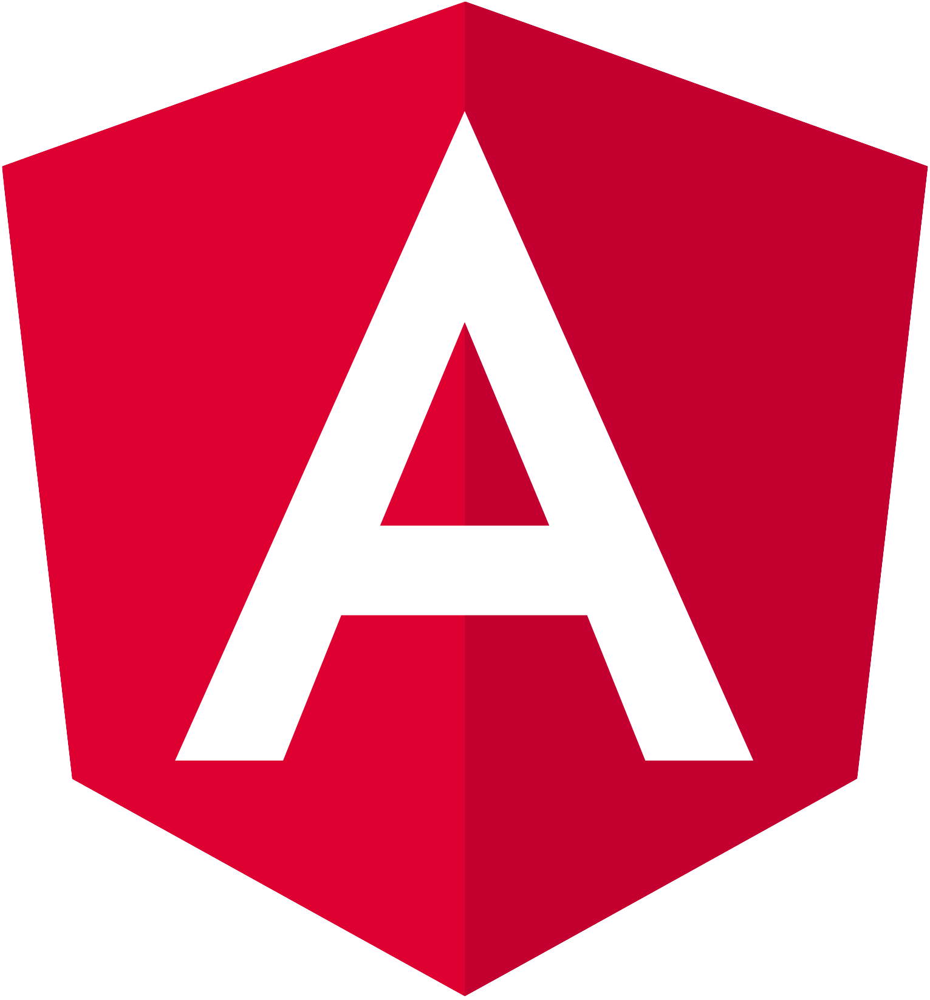

#  Lexxeous's Angular Task Tracker: 

# Summary:

Credit goes to the [Angular Crash Course 2021](https://www.youtube.com/watch?v=3dHNOWTI7H8) by Traversy Media.

This project was generated with [Angular CLI](https://github.com/angular/angular-cli) version 12.2.11.

### Local Backend JSON Database:

This application uses a mock database with the **NPM** package: [`json-server`](https://www.npmjs.com/package/json-server). This allows the use of an REST API within the **Angular** application, to make HTTP requests. Run this *NoSQL* database server by using `npm run db`, then navigate to `http://localhost:5000/`.

### Development Server:

Run `ng serve` (or `npm start`) for a dev server. Navigate to `http://localhost:4200/`. The app will automatically reload if you change any of the source files.

### Code Scaffolding:

Run `ng generate component <component_name>` to generate a new component. You can also use `ng generate directive|pipe|service|class|guard|interface|enum|module`.

### Project Building:

Run `ng build` to build the project. The build artifacts will be stored in the `dist/` directory.

### Running Unit Tests:

Run `ng test` to execute the unit tests via [Karma](https://karma-runner.github.io).

### Running End-to-End Tests:

Run `ng e2e` to execute the end-to-end tests via a platform of your choice. To use this command, you need to first add a package that implements end-to-end testing capabilities.

### Further Help:

To get more help on the Angular CLI use `ng help` or go check out the [Angular CLI Overview and Command Reference](https://angular.io/cli) page.
